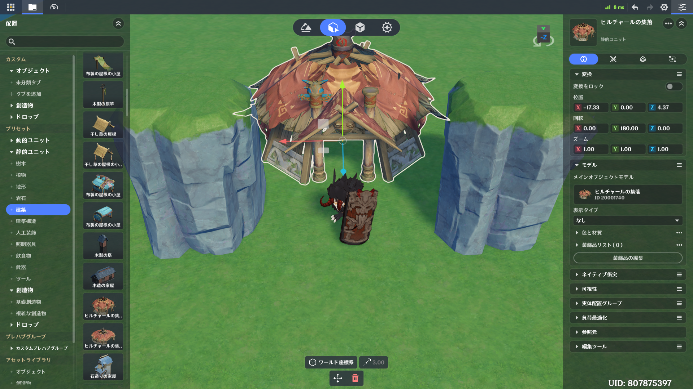
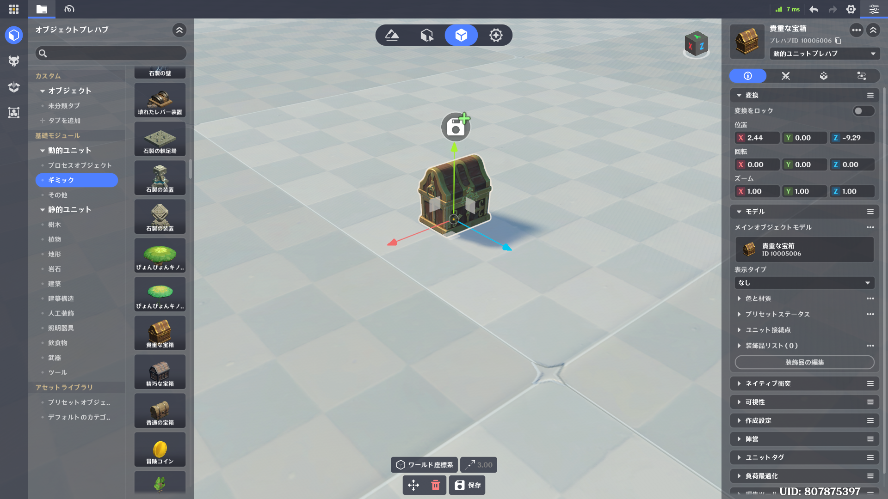
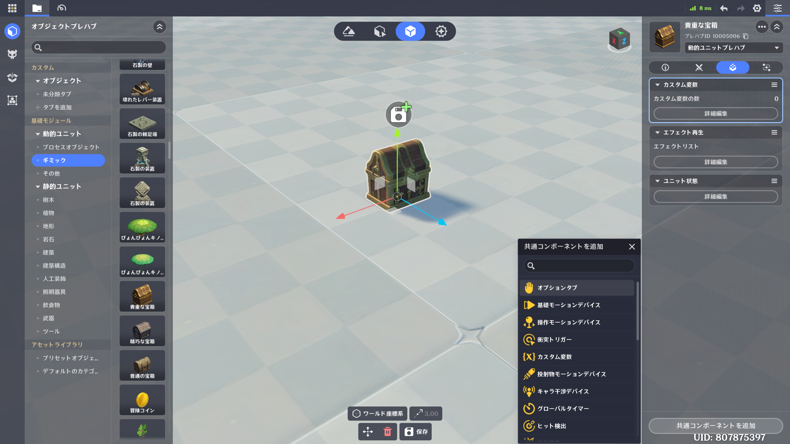
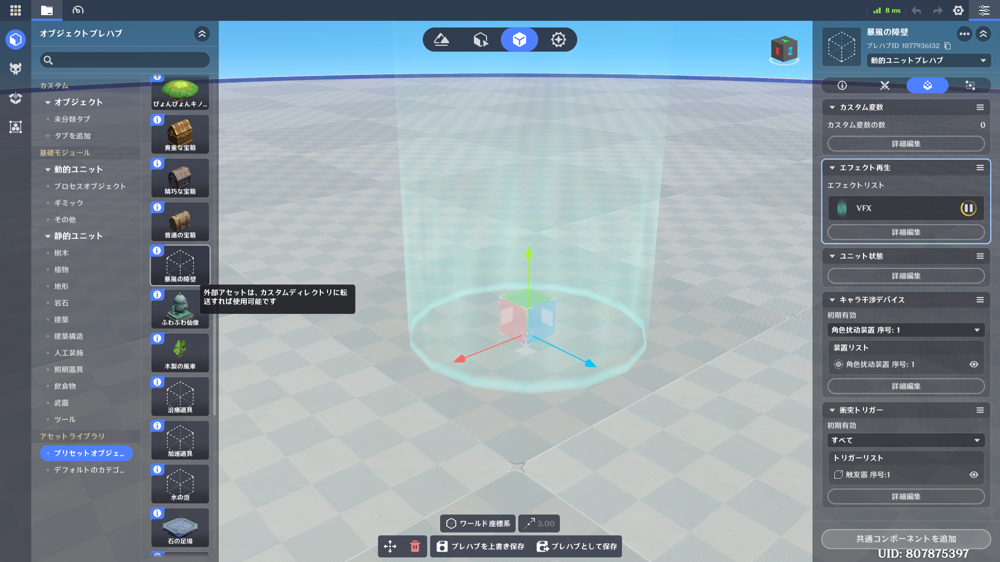
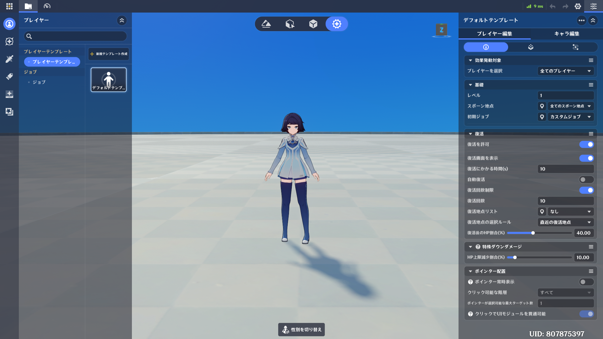
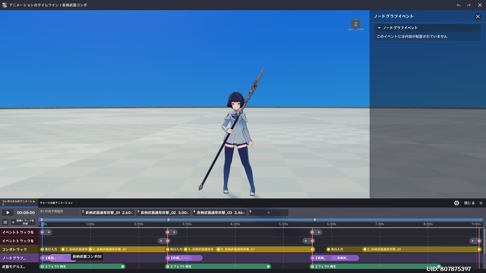
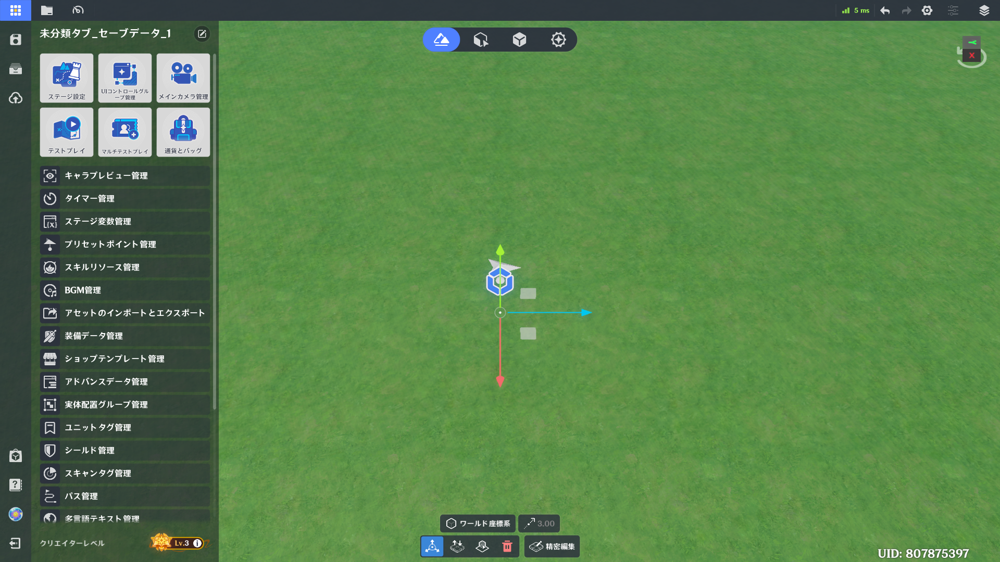

# 機能概要

本ページでは、大体どこにどんな機能があるのかをざっくり紹介します。  
何か自分でやりたいことがあるときに、このページの内容を把握していれば、自分で探しやすくなると思います。  
機能ごとの詳細な説明については、各機能のページで記載します。

## 地形編集
上部タブの一番左のタブが、地形編集タブです。  
- 地形の制作、編集  
- 天気、環境の編集  
- エンティティ（オブジェクトや創造物等）の配置  

<video controls playsinline preload="metadata" style="width: 100%; max-width: 960px; border-radius: 12px;">
  <source src="../../../assets/videos/beginner/learn/editor-overview/terrain-editing.mp4">
</video>
ステージの見た目に関するものをいじりたいと思ったら、ここを探してみてください。  
※　エンティティの配置については、後述の通り、エンティティ配置と比較すると、機能が制限されているので、注意してください。  

## エンティティ配置
上部タブの左から二番目のタブが、エンティティ配置タブです。  
- エンティティ（オブジェクトや創造物等）の配置  
- 配置したエンティティの編集  

エンティティを配置したり編集したりする際には、基本的にこのタブで作業することになります。  

### 地形編集とエンティティ配置の違いについて
地形編集とエンティティ配置は、どちらもオブジェクトの配置が出来るようになっており、違いがわかりにくいのですが、下記のような差分があります。    

- 地形や環境の編集は地形編集でしか出来ない  
- オブジェクトの細かい設定の編集はエンティティ配置からしか出来ない  
　（サイズ変更や回転は地形編集でも出来ますが、創造物のステータス変更、挙動制御等はエンティティ配置からしか出来ません）  
- プレハブグループの配置やシーン生成はエンティティ配置からしか出来ない  

基本的には、名称通り、地形を編集するなら地形編集、エンティティを配置するならエンティティ配置、と思っておくといいと思います。  

## プレハブライブラリ
上部タブの右から二番目のタブが、プレハブライブラリタブです。  
プレハブの作成、編集はここで行います。  
左に下記4つのタブがあり、そこからモデルを選んでプレハブを作成、編集します。  

| タブ         | 扱えるもの                                                                 |
| ---------- | --------------------------------------------------------------------- |
| オブジェクトプレハブ | 自然物、建築物、装飾物等、いわゆる物のプレハブ （見た目は透明で機能持たせる場合なども含みます）                   |
| 創造物プレハブ    | いわゆる敵のプレハブ （用途は敵に限りません）                                            |
| ドロップ       | 入手することでカバンに入るアイテムを扱うためのプレハブ                                           |
| プレハブグループ   | 複数のプレハブをグループ化したもの （グループ化自体はエンティティ配置や他のプレハブタブで行い、ここでは管理、編集のみが行なえます） |

プレハブに設定する項目については画面右側に表示され、ここで様々な設定をすることが出来ます。
設定したい項目がないか、色々触ってみてください。  
特に、オブジェクトに何か機能を持たせたい場合、**共通コンポーネント**を追加することで実現出来る可能性が高いので、是非そこを見てみてください。  

プレハブを作成したら、「プレハブとして保存」を実装することで、エンティティ配置等で「カスタム」として呼び出すことが出来ます

また、**エンティティ配置等では表示されない、様々なプリセットアセット**がこちらでは登録されており、これらは実際に**原神内で実装されている機能が元々組み込まれて**います。  
是非一度プリセットアセットをのぞいてみて、作りたいものや参考になりそうなものがないか見てみてください。

## 戦闘プリセット
上部タブの一番右のタブが、戦闘プリセットタブです。
キャラやスキルに関する各種設定が可能です。
左に下記6つのタブがあります。

| タブ       | 扱えるもの                                 |
| -------- | ------------------------------------- |
| プレイヤー    | プレイヤーやキャラに関する設定                       |
| ユニット状態   | プレイヤーや創造物に付与する状態 （バフデバフ、元素付着、等）    |
| スキル      | スキルの作成、編集 （モーション、エフェクト、効果等の作成、編集）  |
| ローカル投射物  | スキル等で発射する弾丸等                          |
| アイテム     | 入手したらかばんに入るもの                         |
| エフェクトツール | エフェクトの作成、編集 （既存のエフェクトの組み合わせで作成が可能） |

スキルが特に分かりづらく、詳細はスキルのページで記載しますが、**実際にどういう効果を持つか、というのはモーションに対してノードグラフを紐づける**、という形で作ることになります。  
**ユニット状態とスキルには基本的なものがプリセットとして登録されています**ので、そちらも確認してみてください。  

最初のうちに触ることが多いのはプレイヤータブになるかと思いますが、プレイヤーに関する設定にも、下記3種類があります。  

| 項目    | 設定項目                     |
| ----- | ------------------------ |
| プレイヤー | 復活回数や初期ジョブ等、プレイヤー毎に紐づく設定 |
| キャラ   | 戦闘や見た目に関する一部設定           |
| ジョブ   | ステータスやスキル、状態等に関する設定      |

**ステータスやスキル等の設定がジョブである**ことが最初は分かりづらいと思うので、注意してください。

## 星々の箱庭
星々の箱庭は原神とは別に立ち上がるアプリケーションで、基本的にノードグラフの作成を行います。  
ステージギミック等、何か挙動制御を行いたい場合には、ここでノードグラフを作成し、エンティティに紐づけて制御することになります。  
<video controls playsinline preload="metadata" style="width: 100%; max-width: 960px; border-radius: 12px;">
  <source src="../../../assets/videos/beginner/learn/editor-overview/operation-hakoniwa.mp4">
</video>

開いた直後はサーバーノードのウィンドウが大きく出ていますが、下記機能も内包しています。

| 名称                     | 機能                                        |
| ---------------------- | ----------------------------------------- |
| リソースマネージャー             | 現在のデータ内に含まれる各種データの確認等                     |
| クライアントノードグラフリソースマネージャー | クライアントノードグラフの作成、管理等                       |
| ノードマネージャー              | ノード一覧                                     |
| 日誌                     | ノードグラフの実行ログ等の取得                           |
| サーバー信号マネージャー           | 信号の作成、管理等 （エンティティをまたいで挙動制御を行いたい場合等に使用） |
| 負荷検出                   | プレイ時の負荷の検証                                |
上記の機能は星々の箱庭左上の「ウィンドウ」から開くことが出来ます。  

### サーバーノードとクライアントノードについて
ノードグラフにはサーバーノードグラフとクライアントノードグラフが存在し、下記はクライアントノードグラフに該当します。  
- キャラスキルノードグラフ
- 創造物スキルノードグラフ
- 創造物ステータスノードグラフ
- 創造物ステータス決断ノードグラフ
- キャラクター操作スキルノードグラフ
- ブールフィルターノードグラフ
- 整数フィルターノードグラフ

基本的に、ステージのギミックや挙動を作る分には大体サーバーノードグラフで制御可能で、**キャラや創造物のスキル、複雑な挙動制御等をしようと思うと、クライアントノードグラフが必要になる**、といったイメージになります。  
クライアントノードグラフが必要なものについては、「クライアントノードグラフリソースマネージャー」を開き、クライアントノードグラフとして作成しなければ、参照することも出来ませんので、注意してください。  

## システムメニュー
左上のメニューボタンのクリック（あるいはescキー）でシステムメニューが開きます。  

システムメニューでは幻境に関する様々な設定が出来ますので、上記までの機能で設定出来ない項目があれば、システムメニューを探してみてください。  
以下、一例です。  
- ステージ設定（プレイ人数や陣営、スポーン地点の設定等）
- テストプレイ
- UIの作成
- カメラの管理
- BGM管理
- 多言語テキスト管理
- アセットのインポートとエクスポート
- ステージアップロード
- 幻境アセットセンター