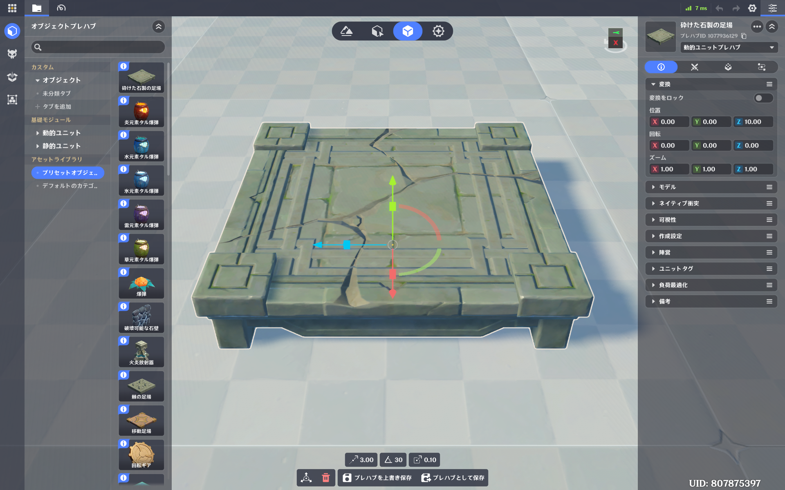

# 制作の進め方のススメ

星々の幻境では、本当に色々なことが出来るようになっており、工夫次第でありとあらゆるステージを作ることが出来るようになっています。  
一方で、何でも出来るようになっている分、**開発経験のない人が制作をしようと思うと、中々ハードルが高い**側面が存在します。

そのため、これから星々の幻境の制作を始めよう、という方には下記をオススメします。

## まずは簡単なステージを作る
星々の幻境でステージを作ろう、と思う方は、「こんなゲームを作ってみたい」、と想像が広がっていることかと思います。  
しかし、**まだ制作に慣れていない状態から、難しいこと、大変なことをやろうと思うと、途中で挫折してしまう可能性が非常に高い**です。  

そのため、まずは**簡単なステージを作って、幻境を完成させて投稿する**、というのを目指していただきたいです。  
実は、星々の幻境では、ある程度ステージを投稿しないと、幻境のランキング機能等が使えない、といった制限があります。  
そういった背景もあり、まずは簡単なステージをいくつか制作して制作に慣れていき、少しずつ凝ったものを作ろうとすることをおすすめします。  

特に、最初は**パルクールステージ**（走ってコインを集めたりするようなステージ）を作ってみることをおすすめします。  
あまり変わったオブジェクトを作る必要はなく、地形と最低限のオブジェクトで出来るはずです。  
私も最初はパルクールから入りました。  
（このステージの実際の作り方は後日記載予定です）
::tweet{url="https://x.com/Chross_isao/status/2065411584563003573"}

## なるべく元からあるアセットを活用する
星々の幻境では、自分の工夫次第で、オブジェクトや敵を色々カスタマイズしながら、自分の好きなように使うことが出来ます。  
しかし、**凝った設定や挙動のオブジェクトを作ろうとすると、中々難しく、挫折しかねません。**  
そこで、なるべく元からあるアセットを利用して、いじれる範囲で設定をいじりながら使ったりすることをおすすめします。

配置画面のプリセット項目にあるのはもちろん、実は**プレハブ作成画面にも、プリセットのプレハブがいっぱいあります。**  

それらを活用すると、オブジェクトを一から制作するよりも格段に楽に制作が出来るので、これらを基にし、パラメータ等を少しいじって制作することをおすすめします。  
また、直接これらを使わなかったとしても、ある程度設定がされているものが登録されていたりしますので、やりたいことに近いアセットを見つけて、設定を見てみるのもいいと思います。